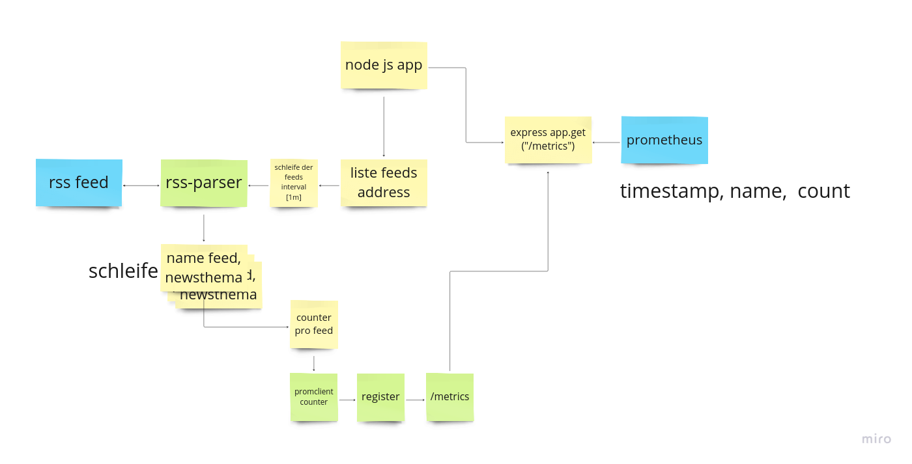

# rss-feeds-metrics

## backend

### nodejs app 
- app go over a table of feeds and parse the data.
- the system check with hashes in table of the item is now collected or not
- if not push the hash in a controlltable and count them with prom client
- the app has a prometheus metrics endpoint for the data

## monitoring

## the node app
- metrics endpoint

## prometheus
- collect all the data

## grafana
- view the data

in backend is the app
in monitoring is the configfiles for the monitoring systems

## here is a flow from the app

