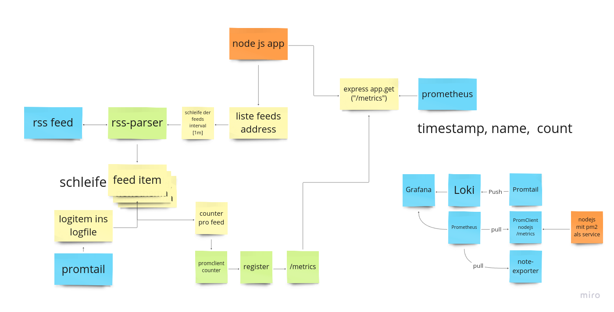

# rss-feeds-metrics

## backend

### nodejs app 
- app go over a table of feeds and parse the data.
- the system check with hashes in table of the item is now collected or not
- if not push the hash in a controlltable and count them with prom client
- the app has a prometheus metrics endpoint for the data

### install node with 

```bash
curl -o- https://raw.githubusercontent.com/nvm-sh/nvm/v0.40.1/install.sh | bash && export NVM_DIR="$([ -z "${XDG_CONFIG_HOME-}" ] && printf %s "${HOME}/.nvm" || printf %s "${XDG_CONFIG_HOME}/nvm")" && [ -s "$NVM_DIR/nvm.sh" ] && \. "$NVM_DIR/nvm.sh" && source ~/.bashrc && nvm install --lts
```

### install pm2 for better handling

```bash
npm install pm2@latest -g
```

## monitoring

## the node app
- metrics endpoint

## prometheus
- collect all the data

## grafana
- view the data

in backend is the node app

in monitoring the configfiles for the monitoring systems

## here is a flow from the app


